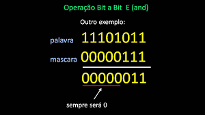
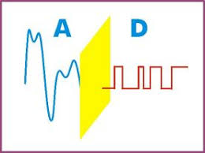
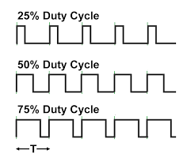
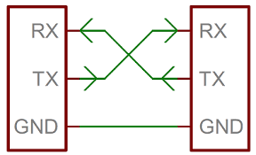

# ARDUINO EM C PURO

Atividades realizadas para a disciplina de sistemas embarcados ministradas pelo professor [Fábio Vincezi](https://www.omegaflix.com/) para o curso de [Eng. Controle e Automação](http://www.feelt.ufu.br/Engenharia-de-Controle-e-Automacao) da **Universidade Federal de Uberlândia**.

## Cronograma das Atividades

- [x] 1° Atividade **Input-Output**
- [x] 2° Atividade **ADC**
- [x] 3° Atividade **PWM**
- [x] 4° Atividade **Maquina de Estados**
- [x] 5° Atividade **UART**
- [x] 6° Atividade **Timers e ISR**

A IDE do arduino foi utilizada para a criação de todos os codigos nas atividades propostas. É importante salientar que esses códigos não portabilidade, por conta do baixo nível de programação empregado, sendo compatível apenas com o microcontrolador ATMEGA328P.

## Requisitos

Para compreender os conceitos usados na geração dos códigos para as atividades propostas é necessário ter conhecimentos em Programação em C e eletrônica digital.

## Overview

* Na primeira atividade o conceito de [operações bitwise( bit a bit )](https://www.embarcados.com.br/bits-em-linguagem-c/) foi explanado. Fomos ainda apresentados aos conceitos rotação de bits e [registradores](https://pt.wikipedia.org/wiki/Registrador_(inform%C3%A1tica)). [Codigo](https://github.com/alpinista06/ARDUINO_EM_C_PURO/tree/master/Input-Output)

* Na segunda atividade estudamos como funciona uma [conversão Analógico-Digital](https://pt.wikipedia.org/wiki/Conversor_anal%C3%B3gico-digital), como e onde empregá-la. [Codigo](https://github.com/alpinista06/ARDUINO_EM_C_PURO/tree/master/AD)

* Na terceira atividade foi passado o principio de funcionamento do [PWM](https://pt.wikipedia.org/wiki/Modula%C3%A7%C3%A3o_por_largura_de_pulso) suas vantagens e situações onde deve ser empregado. [Codigo](https://github.com/alpinista06/ARDUINO_EM_C_PURO/tree/master/PWM)

* Na quarta atividade boas práticas de programação foram inseridas com o implemento de [maquinas de estados](https://pt.wikipedia.org/wiki/M%C3%A1quina_de_estados_finita) no código C. [Codigo](https://github.com/alpinista06/ARDUINO_EM_C_PURO/tree/master/Maquina_de_estados)

* Na quinta atividade a [comunicação serial](https://pt.wikipedia.org/wiki/Comunica%C3%A7%C3%A3o_serial) foi explicada e implementada. Vale ressaltar que no  [Codigo](https://github.com/alpinista06/ARDUINO_EM_C_PURO/blob/master/USART/UART_comunication.c) que está comentado linha a linha para um melhor entendimento, a função **uart_putchar** envia apenas 1 caractere por ciclo , mas exitem outras formas de se enviar palavras maiores, ainda é necessário fazer a conversão de de inteiro para caractere usando a função **itoa** pois a uart só trabalha com dados do tipo **char**. Para compreender o conceito e saber reproduzi-lo basta entender as partes comentadas, as demais são importantes apenas para está aplicação, que é printar uma contagem crescente de números.

* Na sexta atividade os conceitos de medição de tempo usando os [Timers](https://www.embarcados.com.br/timers-do-atmega328-no-arduino/) e [tratamento de rotinas de interrupção](https://pt.wikipedia.org/wiki/Interrup%C3%A7%C3%A3o_de_hardware) foram discutidos e implementados. [Codigo](https://github.com/alpinista06/ARDUINO_EM_C_PURO/tree/master/Timer1-ISR/src)

